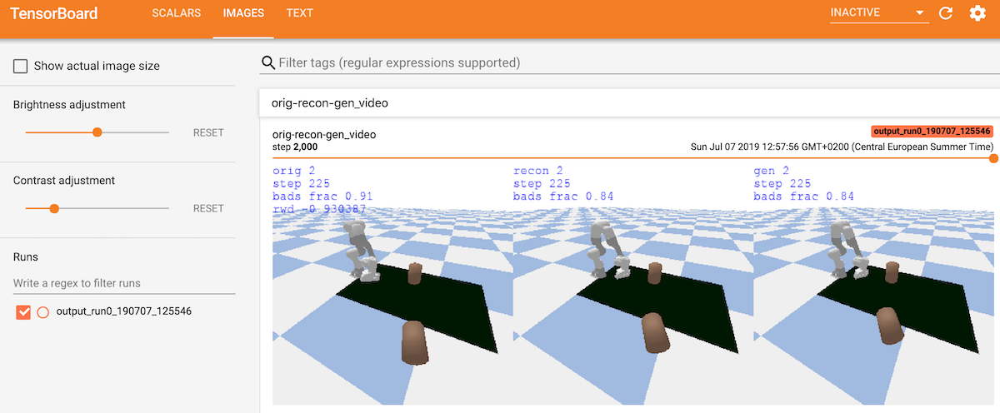
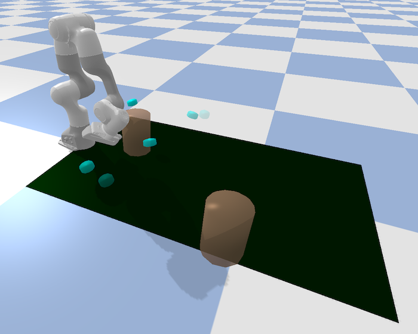

## BO-SVAE-DC code for CoRL2019 submission (anonymized)

### Installation

Set up virtualenv:
```
virtualenv --no-site-packages -p /usr/bin/python3.6 ENV
source ENV/bin/activate
pip install numpy
```
On OS X use: ```usr/local/bin/python3.6```, or specify another path where you have python3.6.

Install pybullet environments for Yumi and Franka:
```
cd gym-bullet-extensions
pip install -e .
cd ../
```

This installs various ABB Yumi and Franka Emika environments. The ones we used in our experiments are: YumiVel-v2, FrankaTorque-v2.
Viz suffix makes pybullet visualize. In the ending '-v2', 2 stands for the number of objects in the env.

Our code for the Daisy environment we used in our experiments is included in ```gym-daisy-custom``` module. However, the base class it uses for the pybullet Daisy simulator is in the process of being open-sourced by another group (should be out shortly). So all our work is included in this repo, but at the moment there is no way to give the public access to the lower-level pybullet Daisy simulation code.


Install SVAE-DC training and BO repo:
```
cd svae-dc
pip install -e .
cd ../
```

### Visualizing Yumi and Franka envs:
```
python svae-dc/svae_dc/env_demo.py \
 --env_name=FrankaTorqueViz-v2 \
 --controller_class=WaypointsMinJerkPolicy

python svae-dc/svae_dc/env_demo.py \
 --env_name=YumiVelViz-v2 \
 --controller_class=WaypointsVelPolicy
```
See args in ```svae-dc/svae_dc/env_demo.py``` for more options.

Note: Yumi visualization is quite compute-heavy for a machine without hardware graphics acceleration. It runs perfectly fine on a Linux Ubuntu desktop, but is quite slow on OS X Macbook Pro. On the other hand, Franka envs were fast on all machines we tested on.


### Data collection:

Example of collecting 1K episodes from FrankaTorque env:

```
python svae-dc/svae_dc/collect_env_experience.py \
 --env_name=FrankaTorque-v2 \
 --controller_class=WaypointsMinJerkPolicy \
 --output_prefix=experience/ \
 --num_episodes=1000 --seed=0 --num_procs=8
```
Note: OS X does not play well with multiprocessing options, so use ```--num_procs=1``` to turn off multiprocessing. If you are planning to train SVAE-DC, then you would likely want to collect 100K-1M trajectories. In that case you would likely be running this on a Unix system anyways. Here we are using 1K just as a quick example to show how to set up SVAE-DC training and BO. For Franka envs collecting 100K trajectories should take less than 1hr on a quad-core CPU machine, (the time depends on your exact compute specs, of course)

Run the above command with a different seed to get a shard of training data as well (e.g. ```--seed=1```)

### SVAE-DC training:

```
python svae-dc/svae_dc/svae_dc_main.py --gpu=0 \
 --env_name=FrankaTorque-v2 \
 --controller_class=WaypointsMinJerkPolicy \
 --learning_rate=1e-4 --batch_size=32 \
 --svae_dc_hidden_size=128 \
 --svae_dc_tau_size=4 --svae_dc_K_tau_scale=0.01 \
 --svae_dc_coder_type=conv \
 --svae_dc_latent_type=conv \
 --env_episodes_file=experience/episodes1K_seed0_FrankaTorque-v2.npz \
 --test_env_episodes_file=experience/episodes1K_seed1_FrankaTorque-v2.npz \
 --log_interval=100 --save_interval=1000 \
 --video_steps_interval=25 \
 --output_prefix=svaedata/
```
See ```svae-dc/svae_dc/svae_dc_args.py``` for more arguments.

All the SVAE-DC (NN) training is implemented in PyTorch. For visualization we use TensorboardX module to get a nice visual output for training. Start tensorboard:
```
tensorboard --logdir=svaedata/ --port=6006
```

Go to ```http://localhost:6006``` in you browser and you should see TensorBoard: 
* SCALARS tab will have plots
* IMAGES tab will have reconstruction and generation videos 
* TEXT tab will have parameters of the training job you launched

They should looks similar to this example:



After some time you should see recon (middle) and gen (right) roughly match the original (left). You can make smoother videos by setting a lower ```--video_steps_interval```, but that will take more CPU time.

Note on the training: 'bad frac' does not need to match between orig/recon/gen. As long as recon/gen have higher 'bad frac' that varies in the same direciton as the one printed in orig - that should be enough for BO. 

When training with very little data (as in this this example) you might see warnings. So: collect a proper amount of data (100K+). You also might need to distill your data to throw away redundant trajectories, if your domain is such that the data is heavily skewed. See ``distill_env_epxerience.py``


### Bayesian Optimization (BO):

SVAE-DC training will create checkpoints in directories that look like ```svaedata/output_run0_190707_120729/```. The last two checkpoint will be kept during training. Once you are satisfied with the training, pick a checkpoint and start BO:

```
python svae-dc/svae_dc/bo_main.py --gpu=0 --run_id=0 \
 --bo_num_init=2 --bo_num_trials=20 \
 --bo_kernel_type=SVAE-DC-SE \
 --env_name=FrankaTorque-v2 \
 --controller_class=WaypointsMinJerkPolicy \
 --svae_dc_override_good_th=0.35 \
 --svae_dc_checkpt=svaedata/output_run0_190707_125546/checkpt-14000.pt \
 --output_prefix=botorchdata/
```

```svae_dc_override_good_th``` parameter is not required, but can be useful (see notes for more info).

<hr />

## Visualize best controllers found by BO.

BO training will produce output in ```botorchdata``` with log files and npz files that record BO results (e.g. ```botorchdata/output_FrankaTorque-v2_SVAE-DC-SE_UCB1.0_run0/x_y_all_run0.npz```)

You can load and visualize best controllers from BO runs (we included example ```x_y_all_run0.npz``` file:

```
python svae-dc/svae_dc/env_demo.py \
 --env_name=FrankaTorqueViz-v2 \
 --controller_class=WaypointsMinJerkPolicy \
 --policy_file=svae-dc/svae_dc/utils/x_y_all_run0.npz
```

You should see a policy that successfully pushes one of the blocks across the table. A risky one (since the block ends up just on the edge of the table area), but that's only after a few minutes fo training on 1K data points, so not bad for a start :-)




<hr />
<hr />
<hr />

## Notes

### Installation Notes

The above installation and demo instruction have been tested on Linux Ubuntu 18.04 and OS X 10.14.5 (Mojave). Key version numbers (that pip served at the time we wrote instructions):
```
numpy-1.16.4
scipy==1.3.0
six==1.12.0
pybullet-2.5.1
moviepy==1.0.0
mpi4py==3.0.2
torch==1.1.0.post2
tensorflow==1.14.0
tensorboard==1.14.0
tensorboardX==1.8
gpytorch==0.3.3
botorch==0.1.1
```

<hr />

### PyBullet Notes

To make sure numpy is enabled for PyBullet try:
```
python
>import pybullet
>pybullet.isNumpyEnabled()
```

If you get 0 as the result of the above then try:
```
pip uninstall pybullet
pip --no-cache-dir install pybullet
```

If pybullet simulator fails to install on your machine, sometimes it is easier to install it from source. For installation troubleshooting and further information on PyBullet see https://pybullet.org

<hr />

### SVAE-DC Training Notes

We mostly used a default value of 0.8, tested low values like 0.35 as well.
To see what a good value would be for your case: look at SVAE-DC training output logs (e.g. ```svaedata/output_run0_190707_120729/log.txt```). You will see printouts like this:

```
2019-06-27 16:58:58,798 true_goodness
2019-06-27 16:58:58,798 tensor([[1.0000],
        [0.8343],
        [0.0938],
        [0.2814]])
...        
2019-06-27 16:58:58,805 Visualizing epoch 190000
2019-06-27 16:58:58,815 knl res for bids 0 1
2019-06-27 16:58:58,818 goodness
2019-06-27 16:58:58,818 [0.6777 0.8109]
2019-06-27 16:58:58,820 transformed_goodness
2019-06-27 16:58:58,820 [0.9997 1.    ]
...
2019-06-27 16:58:58,840 knl res for bids 2 3
2019-06-27 16:58:58,843 goodness
2019-06-27 16:58:58,843 [0.109  0.2792]
2019-06-27 16:58:58,844 transformed_goodness
2019-06-27 16:58:58,844 [0.0024 0.1455]
2019-06-27 16:58:58,845 raw distance (norm) 0.4701
```

The above log snippet is from training with ```--good_th=0.35```: trajectories with goodness>0.35 will be considered acceptable. You can see that in the output snippet: test trajectories 0,1 (bids 0, 1) have high true goodness (1.0, 0.83) and also high goodness according to SVAE-DC (0.677, 0.8109). While test trajectories 2,3 (bids 2,3) have low true goodness (0.0938, 0.2814) and also low goodness according to SVAE-DC: (0.109  0.2792). So, a threshold of e.g. 0.35 is appropriate separation of good-vs-bad trajectories in this case. 

In the future we could let users specify good/bad in a more visual way during data collection. This information can't be extracted from reward, since we don't want to make reward-dependent kernels. Instead the 'goodness' is something about the desirability/stability/safety overall, and that is not strictly task-independent (but it can vary depending on the domain and which behaviors are considered acceptable/desirable).

<hr />

### BoTorch Notes

BoTorch code from Facebook AI is still experimental and rapidly developing. You will notice comments about it in the code. If you are running on a GPU with a limited memory: reduce the number of internal samples used during BO optimization: see ```svae-dc/svae_dc/utuils/bo_constants.py```

<hr />
